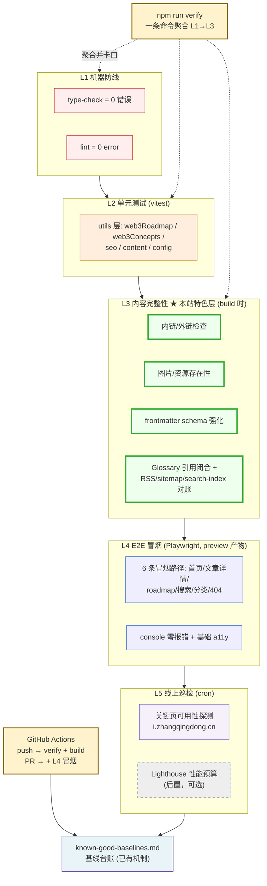
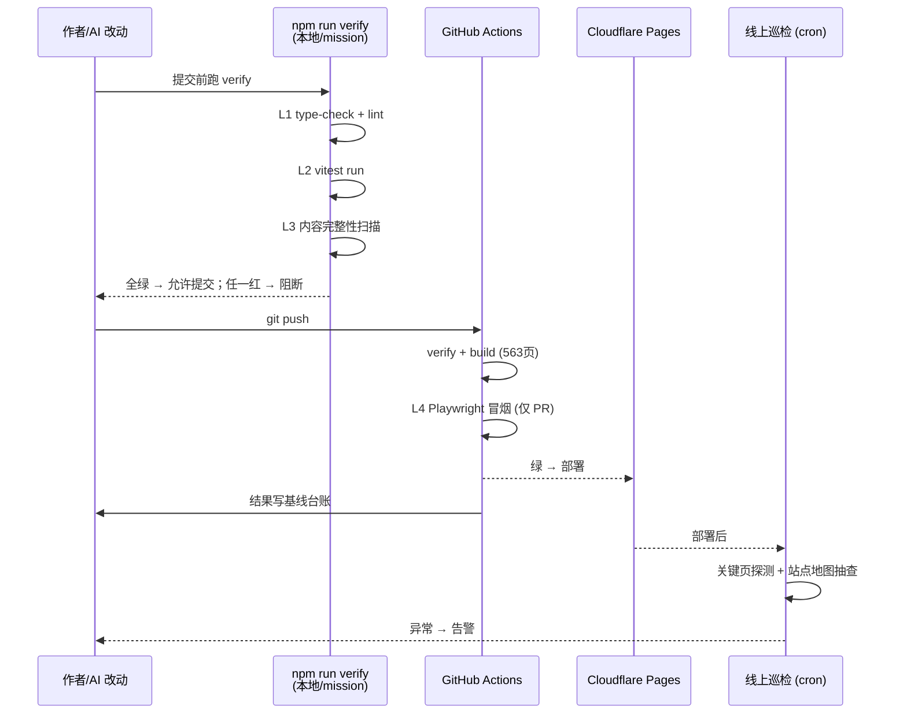

# 质量测试体系设计（Quality Assurance Architecture）

> Status: PROPOSAL — 待 Gerrad 拍板后落地
> Date: 2026-09-09
> Scope: product_whoami 全站质量防线；不改业务功能

## 1. 问题定义

当前防线现状（2026-09-09 实测证据，见 `docs/testing/known-good-baselines.md`）：

| 层 | 现状 | 风险 |
|---|---|---|
| type-check | ❌ 1 个 TS 错误（MermaidDiagram.tsx TS2345） | 红灯常态化，防线失效信号 |
| lint | ❌ 14 个存量 error | 同上 |
| 单元测试 | ⚠️ 仅 4 个用例（config.test.ts），utils 层 6 个模块只测了 1 个 | 回归无网 |
| 内容完整性 | ❌ 零防线：死链、坏图、frontmatter、Glossary 引用全靠肉眼 | **内容站最大风险敞口** |
| E2E | ❌ 无（project-context 记录 `none`） | 部署产物行为不可知 |
| 线上巡检 | ❌ 无 | 生产事故只能靠用户发现 |

核心判断：这是 563 页的内容站，质量风险大头在**内容完整性**而非代码逻辑，但现有防线恰好相反——代码层半残、内容层为零。

## 2. 架构图

### 2.1 五层防线总览



### 2.2 执行时序（改动如何流过防线）



### 2.3 L3 内容完整性检查矩阵（投入产出比最高的一层）

| 检查项 | 规则 | 失败示例 |
|---|---|---|
| 内链检查 | 扫 MDX/astro 中 `href`/`src` 相对路径，目标必须存在（含 anchor 对 slug 校验） | 文章链接到已改名的概念页 |
| 图片存在性 | `heroImage`、`` 引用的本地/远程资源可解析 | frontmatter 写了不存在的图 |
| Frontmatter | Content Collections schema 已有，增加：pubDate ≤ 今天、tags 非空、description 长度区间 | 忘写 description |
| Glossary 闭合 | `<GlossaryTerm term="x">` 的 x 必须在词典 JSON 中注册 | 词典词条改名后引用悬空 |
| 产物对账 | build 后：sitemap URL 数 = 页面数；search-index 覆盖所有非 draft 文章；RSS 含最新 N 篇 | 新文章漏进搜索索引 |

## 3. 目录与产物

```
product_whoami/
├── scripts/
│   └── verify.sh              # L1→L3 聚合，exit code 语义化
├── e2e/
│   ├── smoke.spec.ts          # L4 冒烟（6 条路径）
│   └── playwright.config.ts   # 打 astro preview 产物
├── src/utils/__tests__/       # L2 补齐（colocated）
│   ├── web3Roadmap.test.ts
│   ├── web3Concepts.test.ts
│   └── ...
└── .github/workflows/
    └── quality.yml            # push: verify+build；PR: +e2e
```

`npm run verify` 输出对齐 mission-driver 的 BUILD_VERIFY 消费格式（marker: pass / fail + 分层摘要）。

## 4. 实施计划（建议切 4 个 WI）

| WI | 内容 | 前置 | 规模 |
|---|---|---|---|
| Q1 | L1 归零：修 TS2345 + 14 lint error，verify.sh 只含 L1 | 无（当前代码已提交） | 小 |
| Q2 | L3 内容完整性：链接/图片/glossary/产物对账脚本 | Q1 | 中 |
| Q3 | L2 单测补齐 utils 5 模块 | Q1 | 小 |
| Q4 | L4 Playwright 冒烟 + CI workflow | Q2（冒烟会踩内容坏链） | 中 |

L5 线上巡检后置：等 Q1-Q4 稳定后用 cronjob 挂定时探测即可，不进本期。

## 5. 边界与不做的事

- 不追求覆盖率数字，L2 只锁 utils 纯函数
- 不做视觉回归（内容站样式变动频繁，误报成本高）
- 外链检查默认只验 HTTP 可达且**不卡 CI**（外网抖动会假红），放 L5 巡检
- `npm run dev/preview` 交互进程不进 verify（沿用 project-context 的语义边界）

## 6. 验收标准

1. `npm run verify` 一条命令在干净树上 exit 0
2. 故意制造一个死链 / 一个悬空 Glossary 引用，L3 必须报错并指到文件行号
3. GitHub Actions push 后 10 分钟内给出 verify+build 结论
4. 全绿后基线台账新增一行（复用现有 known-good-baselines 机制）
